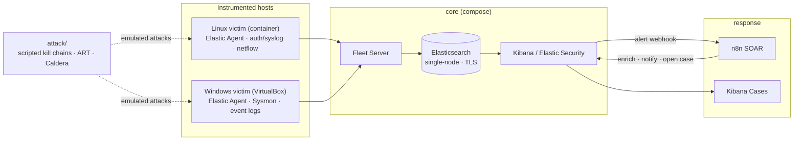

# SOC-in-a-Box

A self-contained, reproducible **Security Operations Center** lab on the Elastic Stack.
One command brings up a SIEM; from there the repo walks the full detection lifecycle —
**telemetry → detection-as-code → adversary emulation → triage → automated response** —
with every rule, playbook, and dashboard version-controlled and CI-tested.

Built to run on a single 16 GB workstation.

[](https://github.com/justinmreynolds93-afk/soc-in-a-box/actions/workflows/detection-ci.yml)
[](https://github.com/justinmreynolds93-afk/soc-in-a-box/actions/workflows/lint.yml)
-yellow)


> **Status:** `v1.0` — M0–M7 built, running, and verified against live data.
> Two Fleet agents online (Linux container + **Windows host**), 256 detection
> rules enabled (250 succeeded / 6 partial / 0 failed), all 13 custom rules
> executing green on real Sysmon/Security/auth telemetry. Numbers pulled from the
> API in [`docs/verification.md`](docs/verification.md). Attack-validating the
> Windows rules needs the VirtualBox victim VM (`vm/`) — attacks are never run
> against the host ([`docs/scope.md`](docs/scope.md)).

---

## What this demonstrates

| Capability | Where it lives |
|---|---|
| SIEM deployment as infrastructure-as-code (TLS, Fleet, one command) | `compose/` |
| Endpoint + network telemetry via Fleet-managed Elastic Agent | `compose/victim-linux/`, `compose/config/kibana.yml` |
| Detection-as-code — 13 rules, one file each, MITRE-mapped, with writeups | `elastic/detection-rules/`, `docs/detections/` |
| Portable Sigma rules + CI conversion to Elastic | `elastic/sigma/` |
| **Honest coverage analysis** — what the telemetry can and can't catch | `docs/detection-coverage.md` |
| Adversary emulation — scripted kill chains, Atomic Red Team, Caldera | `attack/` |
| Detection CI — schema + ATT&CK-mapping validation, Sigma convert | `.github/workflows/detection-ci.yml` |
| SOAR — enrich → Slack → Kibana case | `soar/n8n/` |
| Incident-response runbooks | `docs/runbooks/` |

## Verified

Pulled from the Elasticsearch / Kibana APIs on the running lab — full snapshot
and repro commands in [docs/verification.md](docs/verification.md).

| Check | Result |
|---|---|
| Fleet agents online | **2** — `Justin` (Windows 11 Home, `windows-victim-policy`) · Fleet Server (Ubuntu 24.04) |
| Detection rules enabled | **256** — 250 `succeeded`, 6 `partial failure`, **0 `failed`** |
| Custom rules (`SOC-in-a-Box`) | **13 / 13 execute `succeeded`** against live telemetry |
| Windows telemetry (10 min) | `windows.sysmon_operational` 3,440 · `system.security` 918 |
| Sysmon coverage | ProcessAccess, PipeEvent, RegistryEvent, Network connection, Image load, FileCreate, Process creation, DNS, FileDelete, ProcessTampering |
| Events indexed (`logs-*` / `metrics-*`) | ~325,000 |
| Linux scenario detection | 5 / 11 ATT&CK techniques, 27 alerts / 8 rules (`docs/detection-coverage.md`) |

> Windows rules are proven to **execute** on live Sysmon/Security data; **alerting**
> them needs the VirtualBox victim VM — attacks are never run against the host
> ([`docs/scope.md`](docs/scope.md)).


*Security → Explore → Hosts: inventory and 76 processes across 2 hosts, built
entirely from the Sysmon / auth telemetry the agents ship.*

## Architecture

Full diagram, data flow, and design decisions: [docs/architecture.md](docs/architecture.md).



## Quickstart

**Prerequisites:** Docker Desktop (running, 10 GB+ allocated), ~40 GB free disk.
On Windows, start with [docs/windows-setup.md](docs/windows-setup.md).

```powershell
# Windows (no make) — the PowerShell runner:
.\scripts\bootstrap.ps1              # preflight + generate .env + start core, wait for green
.\soc.ps1 telemetry                  # Linux victim + Elastic Agent
.\scripts\enable-detection-rules.ps1 # prebuilt rules, filtered to our telemetry
.\scripts\deploy-detections.ps1      # the 13 custom rules
.\scripts\healthcheck.ps1            # expect 6/6
# Kibana → https://localhost:5601  (user: elastic, password in .env; self-signed cert)
```

```bash
# Linux / macOS / WSL — make, or scripts/bootstrap.sh:
cp .env.example .env && make up && make telemetry
```

Every task is a thin wrapper around `docker compose --env-file .env`; raw commands
in [compose/README.md](compose/README.md).

### Overlays

The lab is split into Compose overlay files so an 8 GB Docker VM never runs more
than it needs:

| Overlay | Brings up | ~RAM | Typical use |
|---|---|---|---|
| base (`docker-compose.yml`) | Elasticsearch, Kibana, Fleet Server | ~5 GB | always on |
| `compose.telemetry.yml` | Linux victim + Elastic Agent | ~1 GB | always on |
| `compose.soar.yml` | n8n | ~0.5 GB | optional |
| `compose.attack.yml` | attacker (+ Caldera) | ~0.3 GB (+1.5) | on demand |
| `compose.casemgmt.yml` | TheHive, Cortex | ~4 GB | on demand (Kibana Cases is the default) |

Working state ≈ 6–7 GB. For attack sessions add a Windows victim VM (~4 GB) and
close other apps.

## Repository layout

```
soc-in-a-box/
├── compose/
│   ├── docker-compose.yml       # core: sysctl, setup, elasticsearch, configure, kibana, fleet-server
│   ├── compose.telemetry.yml    # linux victim
│   ├── compose.attack.yml       # attacker (+ optional Caldera)
│   ├── compose.soar.yml         # n8n
│   ├── config/                  # setup.sh, configure.sh, kibana.yml (Fleet policies as code)
│   └── victim-linux/            # Dockerfile for the Ubuntu + SSH + Agent victim
├── elastic/
│   ├── detection-rules/rules/   # 13 custom rules — one JSON file per rule
│   └── sigma/rules/             # portable Sigma rules (CI converts them)
├── attack/
│   ├── atomic/                  # Atomic Red Team runner + curated technique list
│   └── scenarios/               # scripted multi-stage kill chains
├── soar/n8n/                    # the alert-triage workflow (import into n8n)
├── vm/provision/                # Windows victim: audit policy, Sysmon, agent enroll, ART
├── scripts/                     # bootstrap, setup-fleet, enable/deploy rules,
│                                #   healthcheck, gap report, navigator layer
├── docs/
│   ├── architecture.md · threat-model.md · scope.md · windows-setup.md
│   ├── detection-coverage.md    # the coverage story + ATT&CK layer
│   ├── demo.md                  # 10-minute walk-through
│   ├── detections/              # one writeup per detection
│   └── runbooks/                # IR runbooks
└── .github/workflows/           # lint + detection-ci
```

## Roadmap

- [x] **M0** — Repo scaffold, docs skeleton, architecture diagram
- [x] **M1** — Elastic core up via one command (TLS on, Fleet Server running)
- [x] **M2** — Telemetry: Linux victim + **Windows host** Elastic Agent (Sysmon + Security + auth), Fleet policies as code, prebuilt rules filtered to compatible indices
- [x] **M3** — Adversary emulation: scripted kill chains + Atomic Red Team + Caldera; gap report tooling
- [x] **M4** — 13 custom detections (as code, MITRE-mapped, writeups) + Sigma rules + ATT&CK Navigator generator
- [x] **M5** — Detection CI: rule schema + ATT&CK-mapping validation + Sigma conversion (GitHub Actions)
- [x] **M6** — n8n SOAR playbook (enrich → Slack → Kibana case) + IR runbooks
- [x] **M7** — Polish: architecture + coverage + [verification](docs/verification.md) docs, demo script, `v1.0` tag. Kibana screenshots are optional (`docs/img/`, `scripts/open-kibana.ps1`) — the verification doc carries the evidence.

## Scope & safety

This is a personal skills lab. **All simulated attacks target lab-owned VMs and containers only.**
Read [docs/scope.md](docs/scope.md) before running anything in `attack/`.

## License

[MIT](LICENSE) © 2026 Justin Reynolds
