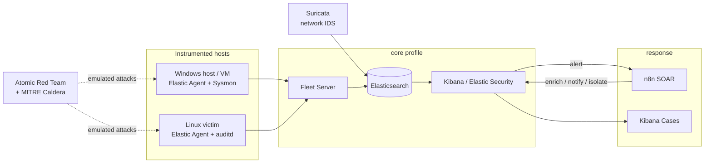

# SOC-in-a-Box

A self-contained, reproducible **Security Operations Center** lab on the Elastic Stack.
One command brings up a SIEM; from there the repo walks the full detection lifecycle —
**telemetry → detection-as-code → adversary emulation → triage → automated response** —
with every rule, playbook, and dashboard version-controlled and CI-tested.

Built to run on a single 16 GB workstation.

<!-- Badges are wired up in M5. -->


---

## What this demonstrates

| Capability | Where it lives |
|---|---|
| SIEM deployment as infrastructure-as-code | `compose/` |
| Endpoint + network telemetry pipelines | `compose/`, `elastic/fleet/` |
| Detection engineering with Elastic's `detection-rules` workflow | `elastic/detection-rules/` |
| Sigma authoring and conversion | `elastic/sigma/` |
| MITRE ATT&CK coverage mapping | `docs/detection-coverage.md` (M4) |
| Adversary emulation (Atomic Red Team, MITRE Caldera) | `attack/` |
| Detection regression testing in CI | `.github/workflows/` |
| SOAR / automated response | `soar/` |
| Incident-response runbooks | `docs/runbooks/` |

## Architecture

Full diagram and data flow: [docs/architecture.md](docs/architecture.md).



## Quickstart

**Prerequisites:** Docker Desktop (running, 10 GB+ allocated), ~40 GB free disk.
On Windows, start with [docs/windows-setup.md](docs/windows-setup.md).

```bash
cp .env.example .env          # then edit the passwords
make up                       # start the Elastic core        (lands at M1)
make status
# Kibana → https://localhost:5601
```

No `make`? Use the PowerShell runner — same verbs:

```powershell
.\soc.ps1 up
.\soc.ps1 status
```

Every task is a thin wrapper around `docker compose`; the raw commands are in
[compose/README.md](compose/README.md).

### Profiles

The lab is split into Compose profiles so a 16 GB host never runs more than it needs:

| Profile | Brings up | ~RAM | Typical use |
|---|---|---|---|
| `core` | Elasticsearch, Kibana, Fleet Server | 7–8 GB | always on |
| `telemetry` | Suricata, Linux victim + agent | ~0.5 GB | always on |
| `soar` | n8n | ~0.5 GB | optional |
| `attack` | Caldera, attacker | ~1.5 GB | on demand |
| `casemgmt` | TheHive, Cortex | ~4 GB | on demand (Kibana Cases is the default) |

Working state ≈ 8–9 GB. Attack sessions: stop the browser, add a Windows victim VM (~4 GB), stay under ~13 GB.

## Repository layout

```
soc-in-a-box/
├── compose/                 # all infrastructure-as-code
│   ├── docker-compose.yml       # core: elasticsearch, kibana, fleet-server
│   ├── compose.telemetry.yml    # suricata, linux victim
│   ├── compose.attack.yml       # caldera, attacker
│   ├── compose.soar.yml         # n8n
│   ├── compose.casemgmt.yml     # thehive, cortex
│   └── config/                  # service configs, agent policies, sysmon config
├── elastic/
│   ├── detection-rules/         # custom rules as TOML (Elastic's detection-rules layout)
│   │   ├── rules/               # rule source
│   │   ├── tests/               # unit tests + sample events
│   │   └── etc/                 # schema / config overrides
│   ├── sigma/                   # source Sigma rules + conversion pipeline
│   ├── fleet/                   # agent policies, integration configs
│   └── dashboards/              # exported saved objects (NDJSON)
├── attack/
│   ├── atomic/                  # Invoke-AtomicRedTeam runner + technique lists
│   ├── caldera/                 # adversary profiles, custom abilities
│   └── scenarios/               # scripted multi-stage kill chains
├── soar/
│   └── n8n/                     # exported workflows
├── vm/                          # Windows victim: Vagrantfile + provisioning
├── scripts/                     # bootstrap, navigator-layer generator, event replay
├── docs/
│   ├── architecture.md
│   ├── threat-model.md
│   ├── scope.md                 # rules of engagement / authorization
│   ├── windows-setup.md
│   ├── detection-coverage.md    # ATT&CK Navigator layer (M4)
│   ├── detections/              # one writeup per detection
│   └── runbooks/                # IR runbooks
└── .github/workflows/           # lint + detection CI
```

## Roadmap

- [x] **M0** — Repo scaffold, docs skeleton, architecture diagram
- [x] **M1** — Elastic core up via one command (TLS on, Fleet Server running)
- [x] **M2** — Telemetry: Linux victim + Elastic Agent (system/network), Fleet policies as code, ~90 curated prebuilt rules
- [x] **M3** — Adversary emulation: scripted kill chains + Atomic Red Team + Caldera; gap report tooling
- [~] **M4** — 13 custom detections (as code, MITRE-mapped, writeups) + ATT&CK Navigator generator; Sigma pipeline pending
- [ ] **M5** — Detection CI: rule validation + event-replay regression harness + coverage badge
- [ ] **M6** — SOAR playbook + IR runbooks (+ optional TheHive profile)
- [ ] **M7** — Showcase polish: final diagram, demo GIFs, writeup, `v1.0`

## Scope & safety

This is a personal skills lab. **All simulated attacks target lab-owned VMs and containers only.**
Read [docs/scope.md](docs/scope.md) before running anything in `attack/`.

## License

[MIT](LICENSE) © 2026 Justin Reynolds
