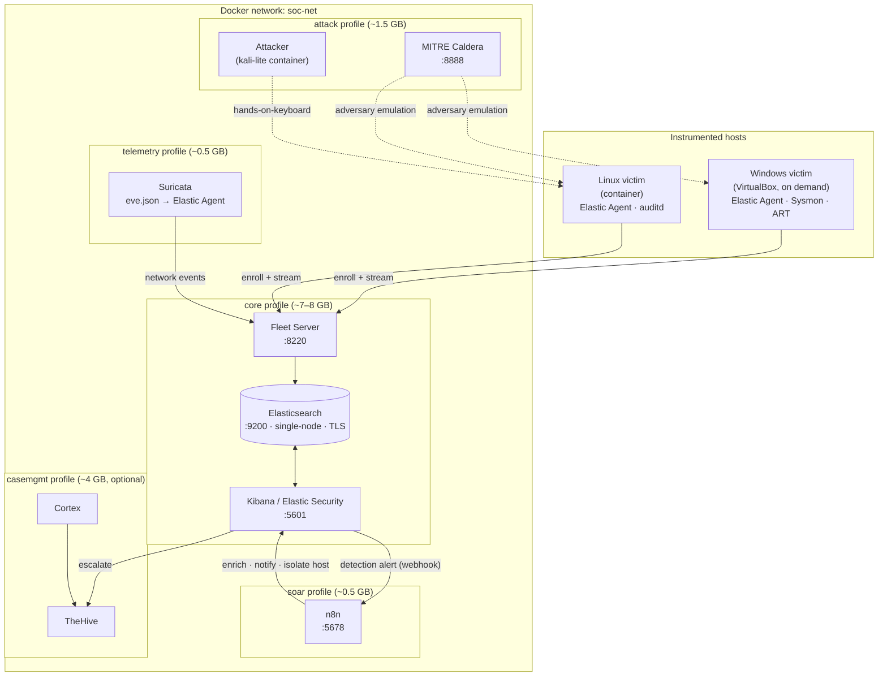

# Architecture

## Goals

1. **Reproducible.** `git clone` → edit `.env` → one command → a working SOC. No click-ops.
2. **Fits a 16 GB workstation.** Compose profiles keep the resident set small; heavy pieces
   run only when needed.
3. **Detection as code.** Every rule, dashboard, and playbook is a file in this repo, reviewed
   and CI-tested like application code.
4. **Closed loop.** Emulated attacks produce telemetry, telemetry drives detections, detections
   drive automated response — and the loop is exercised on every change.

## Component map

## Data flow

| Stage | Mechanism |
|---|---|
| Endpoint collection | Elastic Agent (Fleet-managed). Linux victim: System integration (auth, syslog). Windows victim: System + Windows event logs + Sysmon |
| Network collection | Elastic Agent **Network Packet Capture** integration on the Linux victim — flows + DNS (Suricata was dropped: sniffing other containers' unicast off a Linux bridge is unreliable) |
| Transport | Agent → Fleet Server → Elasticsearch over TLS; data streams `logs-*`, `metrics-*` |
| Detection | Elastic detection engine — prebuilt rules (curated subset) + custom rules from `elastic/detection-rules/` |
| Triage | Kibana Security → Alerts, Timeline, Cases |
| Response | Alert action → webhook → n8n workflow → enrichment, Slack, Kibana case, optional Elastic Defend host isolation |
| Escalation (optional) | TheHive case + Cortex analyzers |

## Key design decisions

- **Single-node Elasticsearch.** A cluster adds nothing for a lab and doubles the RAM. `discovery.type=single-node`, ~1.5 GB heap (Docker set to 8 GB), `vm.max_map_count` handled by a privileged one-shot container.
- **Agents skip TLS verification to Elasticsearch** (`xpack.fleet.outputs[].ssl` → CA path; the fleet default output). Traffic is still encrypted and stays on `soc-net`. A lab simplification — a real deployment pins the CA or a fingerprint.
- **No EDR on the Linux victim.** Elastic Defend's kernel probes are unreliable in the Docker Desktop WSL2 kernel and `auditd` can't own the kernel audit socket from a container. Consequence: Linux process/file techniques are covered by custom rules against auth/syslog/netflow, and by the Windows victim (Sysmon). See [detection-coverage.md](detection-coverage.md).
- **Security + TLS on from the start.** Fleet and the detection engine require it, and "secure by default" is the point of the exercise. A bootstrap container mints the CA, node certs, and service tokens on first run.
- **Fleet-managed agents, not standalone Beats.** Matches how modern Elastic SOCs run and keeps integration config declarative.
- **Kibana Cases as the default; TheHive optional.** Native tooling covers the workflow at zero extra RAM; TheHive + Cortex is there to demonstrate the SOAR-adjacent pattern when resources allow.
- **VirtualBox for the Windows victim.** The host is Windows 11 Home — no Hyper-V, no Sandbox. VirtualBox is the free path; the Linux victim covers the container-native case.

## Ports

| Service | URL |
|---|---|
| Kibana | `https://localhost:5601` |
| Elasticsearch | `https://localhost:9200` |
| Fleet Server | `https://localhost:8220` |
| Caldera | `http://localhost:8888` |
| n8n | `http://localhost:5678` |

## What is deliberately out of scope

- Multi-node / HA Elasticsearch
- Cloud log sources (Supabase, Vercel, AWS) — a different ingestion design; noted in the threat model as a known gap
- Production-grade secret management (uses `.env`; documented as a lab simplification)
