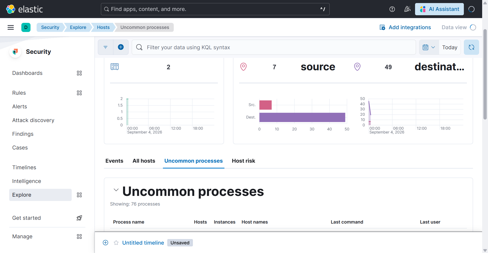

# Verification

A point-in-time capture of the running lab, pulled straight from the
Elasticsearch and Kibana APIs. Reproduce any line with the commands at the
bottom.

**Snapshot: 2026-09-04 05:52 UTC** · Elastic Stack 8.19.20 · Docker Desktop / WSL2 on a 16 GB Windows 11 host



*Security → Explore → Hosts — 76 processes across 2 hosts, assembled from the
Sysmon / auth telemetry the Fleet agents ship. Fleet → Data streams at this
snapshot: `system.security` 12.9 MB, `windows.sysmon_operational` 13.2 MB.*

## Fleet agents

| hostname | OS | policy | agent | status |
|---|---|---|---|---|
| `Justin` | Windows 11 Home (10.0) | `windows-victim-policy` | 8.19.20 | **online** |
| `b40b70b406a0` | Ubuntu 24.04 (Fleet Server) | `fleet-server-policy` | 8.19.20 | **online** |

`linux-victim` (Ubuntu container, `linux-victim-policy`) is enrolled and healthy
when the `telemetry` profile runs; it is stopped in this snapshot to leave RAM
for the Windows agent's collectors (see [detection-coverage.md](detection-coverage.md)).

## Detection rule execution

**256 rules enabled — 250 `succeeded`, 6 `partial failure`, 0 `failed`.**

The 6 "partial" are Elastic prebuilt rules that also query EDR indices
(`logs-endpoint.events.*`) this lab doesn't produce; they still evaluate the
Sysmon / Windows Security data they can see. `scripts/enable-detection-rules.ps1`
filters prebuilt rules by index compatibility and disables ES|QL rules that
hard-fail on absent fields.

### All 13 custom rules

| rule_id | last run | ATT&CK |
|---|---|---|
| `soc-linux-ssh-bruteforce` | succeeded | T1110 |
| `soc-linux-ssh-bruteforce-success` | succeeded | T1110, T1078 |
| `soc-linux-new-local-user` | succeeded | T1136 |
| `soc-linux-user-added-privileged-group` | succeeded | T1098 |
| `soc-linux-cron-suspicious-command` | succeeded | T1053 |
| `soc-linux-root-login-accepted` | succeeded | T1078 |
| `soc-network-external-beaconing` | succeeded | T1071 |
| `soc-network-dns-high-unique-subdomains` | succeeded | T1071, T1568 |
| `soc-win-powershell-encoded-command` | succeeded | T1059 |
| `soc-win-clear-event-logs` | succeeded | T1070 |
| `soc-win-new-local-admin` | succeeded | T1136, T1098 |
| `soc-win-defender-tampering` | succeeded | T1562 |
| `soc-win-lsass-credential-access` | succeeded | T1003 |

The Linux six have also **fired on real attack telemetry** from
`attack/scenarios/linux-intrusion.sh` (see [detection-coverage.md](detection-coverage.md)).
The Windows five are proven to *execute* against live Sysmon/Security data;
firing them needs the VirtualBox victim VM (attacks are not run against the host
— [scope.md](scope.md)).

## Windows telemetry

Live data streams from the Windows host, last 10 min:

| data_stream.dataset | docs |
|---|---|
| `windows.sysmon_operational` | 3099 |
| `system.security` | 899 |
| `system.application` / `system.system` | 2 |
| `elastic_agent.filebeat_input` | 80 |

`windows/metrics` and `system/metrics` inputs are **disabled** — `windows.perfmon`
alone was ~40k docs/10 min and pinned Elasticsearch. A detection lab wants logs.

Sysmon event types, last 30 min:

| event.action | count |
|---|---|
| ProcessAccess (EID 10) | 2430 |
| PipeEvent (EID 17/18) | 2413 |
| RegistryEvent Value Set (EID 13) | 1952 |
| Network connection (EID 3) | 1248 |
| Image loaded (EID 7) | 496 |
| FileCreate (EID 11) | 316 |
| Process creation (EID 1) | 238 |
| DNSEvent (EID 22) | 55 |
| FileDelete (EID 23/26) | 29 |
| ProcessTampering (EID 25) | 10 |

## Reproduce

```powershell
$pw = (Select-String -Path .env -Pattern '^ELASTIC_PASSWORD=(.+)').Matches.Groups[1].Value
$h  = @{ Authorization = "Basic " + [Convert]::ToBase64String([Text.Encoding]::ASCII.GetBytes("elastic:$pw")); 'kbn-xsrf'='1' }

# agents
(irm "https://localhost:5601/api/fleet/agents?perPage=20" -Headers $h -SkipCertificateCheck).items |
  ? active | select @{n='host';e={$_.local_metadata.host.hostname}}, policy_id, status

# rule execution health
$r = irm "https://localhost:5601/api/detection_engine/rules/_find?per_page=500&filter=alert.attributes.enabled:true" -Headers $h -SkipCertificateCheck
$r.data | group { $_.execution_summary.last_execution.status } | select Name, Count

# windows telemetry
$b = '{"size":0,"query":{"range":{"@timestamp":{"gte":"now-10m"}}},"aggs":{"d":{"terms":{"field":"data_stream.dataset","size":20}}}}'
(irm -Method Post "https://localhost:9200/_search" -Headers ($h + @{'Content-Type'='application/json'}) -SkipCertificateCheck -Body $b).aggregations.d.buckets
```

Or `pwsh scripts/healthcheck.ps1`.
